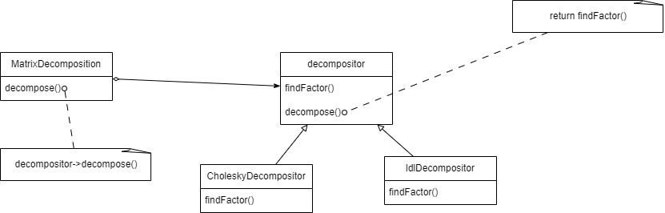

# matrix-decomposition-website
## What's matrix-decomposition-website?
  - provide a caculator for decompose matrix using 2 method is cholesky and LDL

## What's cholesky and LDL decomposition? 
  - Cholesky decomposition is matrix factorization technique, especially valuable for positive definite matrices. It factorizes the matrix into the product of a lower triangular matrix (L) and its conjugate transpose (L^H), where L^H represents the Hermitian transpose of L
  - LDL decomposition is a fundamental technique in linear algebra that factorizes a symmetric matrix into the product of a lower triangular matrix (L), a diagonal matrix (D), and the transpose of L
  - Both method can only decompose matrix squared, symmetric, however Cholesky can only apply to positive definite matrix 
## How are classes of decomposition structured?

### MatrixDecomposition
  - is configured with a decompositor object
  - maintain a reference to a Strategy object
### Decompositor
  - declare an abstract class, MatrixDecomposition uses this abstract class to call the algorithm defined by a stategy which is CholeskyDecompositor & LdlDecompositor
  - define decompose() - skeleton of an algorithm, deferring findFactor() steps for subclasses
### concrete stategy ( CholeskyDecompositor & LdlDecompositor )
  - implements findFactor() method that proper for its algorithm
